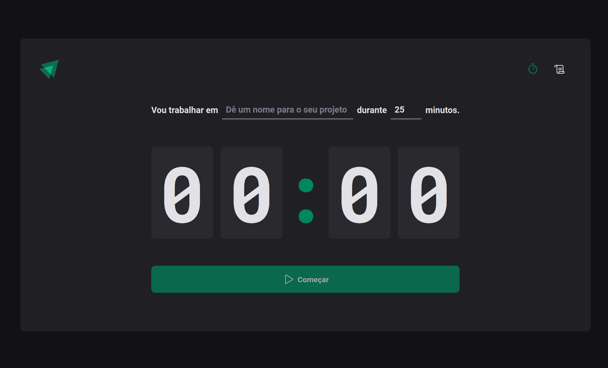
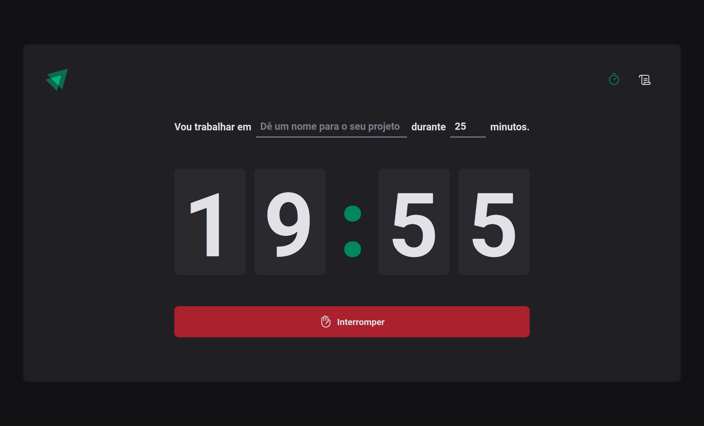
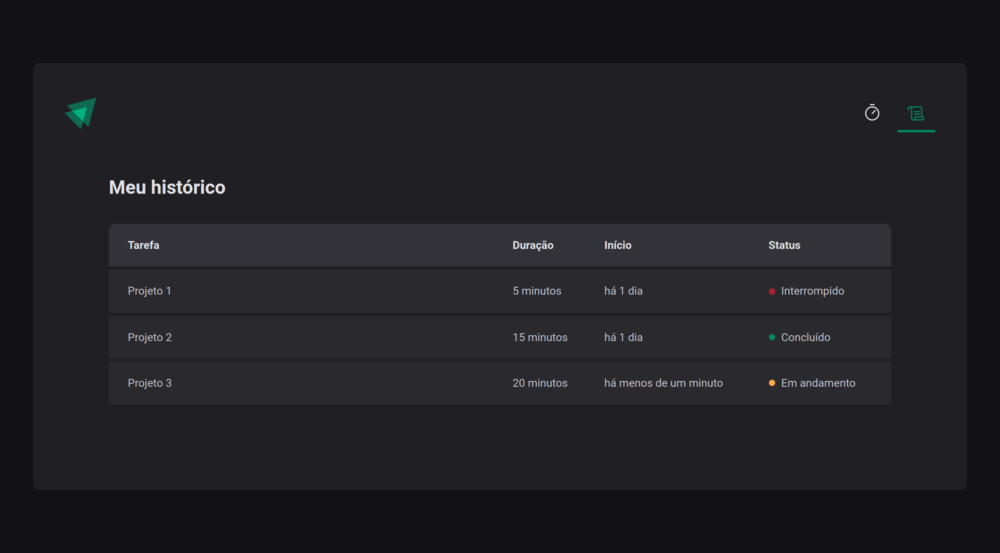

# Ignite Timer - Pomodoro

Aplicação desenvolvida no programa de especialização chamado Ignite, da Rocketseat.

## Tecnologias utilizadas

- [ReactJs](https://pt-br.reactjs.org/)
- [Vite](https://vitejs.dev/)
- [TypeScript](https://www.typescriptlang.org/)
- [ESLint](https://eslint.org/)
- [React Router](https://reactrouter.com/)
- [Styled Components](https://styled-components.com/)
- [Zod](https://zod.dev/)
- [date-fns](https://date-fns.org/)
- [immerjs](https://immerjs.github.io/immer/)

## Telas da aplicação

- Projeto em atividade
  

- Histórico de atividades.
  
